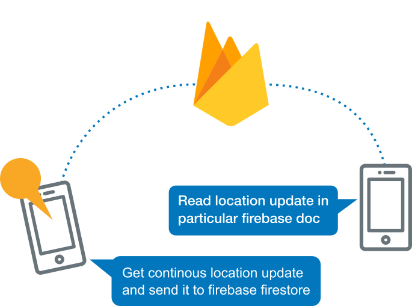

[![LinkedIn][linkedin-shield]][linkedin-url]

 

  

  <h3 align="center">Kotlin & Firebase MVVM Realtime Family Locator App</h3>

  

    Family members tracking application that I developed to practice the knowledge that I learned on the background services, live location tracking, firebase cloud firestore and implementing with google maps API by using recommended architecture components & design patterns.
     
    <a href="">Download the Project</a>
    .

## Table of Contents

* [About the Project](#about-the-project)
  * [Built With](#built-with)
* [How Real Time Tracking Happens](#how-real-time-tracking-happens)
* [License](#license)
* [Contact](#contact)

## About The Project

[![Product Name Screen Shot][product-screenshot]]()

With the family tracker, your potentiality of tracking your family is way better than you do before! Creating a family and get joined into this family with your unique member id will give you a private family tracking experience as real-time with live location data that you continuously fetch. You could invite your all other family members into this family, you can track them as well as they track you. While doing all this, you may create a new family and move your members to that family whenever you want.

The purpose that I aimed while developing this project is to improve and practice the knowledge implementation that I learned lately on always running background services, firebase, MVVM design pattern and Google Maps Api

### Built With

The project structure that I have decided to do is to create all remote services on my own by using "Firebase" and do all the location fetch & writes. For creating the code architecture that I work on nowadays which is "MVVM", I applied kotlin and it's features with better understanding. Tried to decrease the dependencies with coin and do the remote work as asynchronous with kotlin coroutines. The location updates applied on the map by setting member markers with Google Maps. 

The most important task of the app is to listen to location updates of members and send current user location to the family is achieved by creating an "always running background service". 

* [Firebase](https://firebase.google.com/)
* [Maps Sdk](https://developers.google.com/maps/documentation/android-sdk/intro)
* [Coroutines](https://kotlinlang.org/docs/reference/coroutines-overview.html)
* [Koin](https://github.com/InsertKoinIO/koin)
* [Kotlin Extensions](https://kotlinlang.org/docs/reference/extensions.html)
* [Android Services](https://developer.android.com/guide/components/services)

## How Real Time Tracking Happens

    
 

 
 When you open up the application, you must have a member id in order to join a family. This id should be included in that family's document on firebase or you can directly create family, when you choose this way, a family and a member id will be created on the firebase. 

While our never-ending background service working on the background even the app removed, we constantly listen for current joined user location and write this updates to the user's location document on firebase, and we listen for all the family members locations that are included to the family on the background. When there is a change occurs, we re-pin our markers on the map and show the location update. When repinning happens, we create abound to all the locations of markers and create new zooming on the scope of these locations. 

<!-- LICENSE -->
## License

    Copyright 2019 Mehmet Taş

    Licensed under the Apache License, Version 2.0 (the "License");
    you may not use this file except in compliance with the License.
    You may obtain a copy of the License at

        http://www.apache.org/licenses/LICENSE-2.0

    Unless required by applicable law or agreed to in writing, software
    distributed under the License is distributed on an "AS IS" BASIS,
    WITHOUT WARRANTIES OR CONDITIONS OF ANY KIND, either express or implied.
    See the License for the specific language governing permissions and
    limitations under the License.

<!-- CONTACT -->
## Contact

Mehmet Taş - [@twitter](https://twitter.com/tasmehmet_) - m_tas@outlook.com

Project Link: [https://github.com/mehmettas/family-track-location-app](https://github.com/mehmettas/family-track-location-app)

Portfolio : [https://mehmettas.github.io/](https://mehmettas.github.io/)

LinkedIn : [https://www.linkedin.com/in/mehmettass/](https://www.linkedin.com/in/mehmettass/)

<!-- MARKDOWN LINKS & IMAGES -->
<!-- https://www.markdownguide.org/basic-syntax/#reference-style-links -->
[contributors-shield]: https://img.shields.io/github/contributors/othneildrew/Best-README-Template.svg?style=flat-square
[contributors-url]: https://github.com/othneildrew/Best-README-Template/graphs/contributors
[forks-shield]: https://img.shields.io/github/forks/othneildrew/Best-README-Template.svg?style=flat-square
[forks-url]: https://github.com/othneildrew/Best-README-Template/network/members
[stars-shield]: https://img.shields.io/github/stars/othneildrew/Best-README-Template.svg?style=flat-square
[stars-url]: https://github.com/othneildrew/Best-README-Template/stargazers
[issues-shield]: https://img.shields.io/github/issues/othneildrew/Best-README-Template.svg?style=flat-square
[issues-url]: https://github.com/othneildrew/Best-README-Template/issues
[license-shield]: https://img.shields.io/github/license/othneildrew/Best-README-Template.svg?style=flat-square
[license-url]: https://github.com/othneildrew/Best-README-Template/blob/master/LICENSE.txt
[linkedin-shield]: https://img.shields.io/badge/-LinkedIn-black.svg?style=flat-square&logo=linkedin&colorB=555
[linkedin-url]: https://www.linkedin.com/in/mehmettass/
[product-screenshot]: images/family_track_all.png
